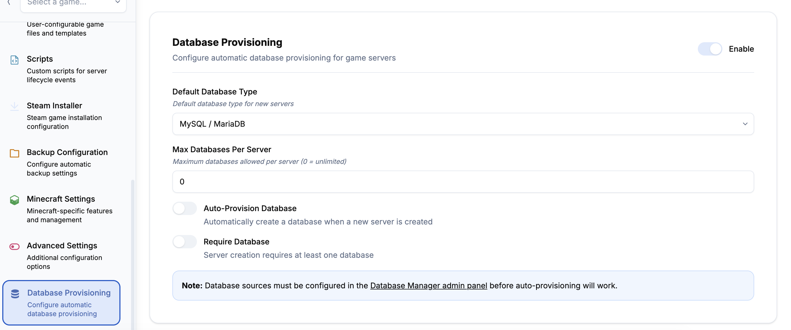

# Database Manager

Provision and manage databases for your game servers with support for MySQL, PostgreSQL, Redis, and MongoDB.

## Features

- **Multi-Database Support**: MySQL, PostgreSQL, Redis, MongoDB
- **Auto-Provisioning**: Automatically create databases with unique credentials
- **Adminer Integration**: Web-based database management interface
- **Connection Management**: Easy access to connection strings
- **Admin Configuration**: Centralized database server management

## Screenshots


*Database management interface*


*Per-server database provisioning*


*Database source configuration*

## Installation

1. Install the extension from the App Store
2. Configure database servers in the admin panel
3. Users can create databases for their game servers

## Configuration

### Admin Setup

**To configure database servers, navigate to:**
```
/extensions/database-manager
```

Or use the sidebar link "Database Sources" that appears for admins.

1. Click "Add Source"
2. Select database type (MySQL, PostgreSQL, Redis, or MongoDB)
3. Enter connection details:
   - **Name**: Friendly name (e.g., "Production MySQL")
   - **Host**: Database server hostname
   - **Port**: Database server port
   - **Admin Username**: Root/admin username
   - **Admin Password**: Root/admin password
   - **Adminer URL**: URL to your Adminer instance (required)
4. Click "Add Source"

The source will now be available for users to create databases from.

### User Usage

1. Navigate to your game server
2. Go to the "Databases" tab
3. Click "Create Database"
4. Select a database server
5. Database is automatically provisioned with unique credentials

## Adminer Integration

For MySQL and PostgreSQL databases, users can click "Open Manager" to access Adminer, a web-based database management tool similar to phpMyAdmin.

### Setting up Adminer

1. Download Adminer: https://www.adminer.org/
2. Place `adminer.php` in your web server
3. Configure reverse proxy or direct access
4. Users will be automatically logged in with their database credentials

## Security

- Each database gets unique credentials
- Passwords are randomly generated (16 characters)
- Admin credentials are stored securely
- Users can only access their own databases

## Supported Games

Any game that requires a database can use this extension:
- Minecraft (plugins with MySQL)
- ARK: Survival Evolved (mods)
- Rust (oxide plugins)
- Custom game servers
